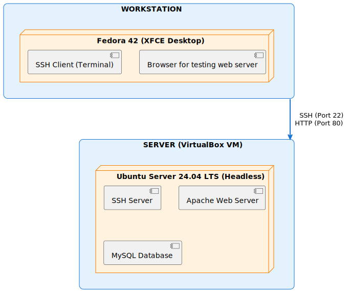

# Week 1: System Planning and Distribution Selection

[← Back to Home](index.md)

## Introduction
This week I set up the basic foundation for my Linux server project. The main goal was to plan out my system and decide which Linux distribution to use.

## 1. System Architecture Diagram

Here's how my setup looks - I have two systems talking to each other:



## 2. Distribution Selection Justification

**My Choice:** Ubuntu Server 24.04 LTS

### Option Analysis

I evaluated four major server distributions based on Stability, Support, and Learning Curve.

| Feature | Ubuntu Server 24.04 LTS | Debian Stable (12) | Rocky Linux 9 | Fedora Server 40 |
| :--- | :--- | :--- | :--- | :--- |
| **Release Model** | **LTS** (5 years standard, up to 12) | **Stable** (approx. 3 years) | **LTS** (10 years, RHEL clone) | **Rapid** (13 months, frequent updates) |
| **Package Manager** | `apt` (user-friendly, vast repos) | `apt` (strict stable guidelines) | `dnf` (enterprise standard) | `dnf` (bleeding edge) |
| **Software Age** | Balanced (stable but reasonably new) | Older (extremely stable) | Conservative (older, enterprise focused) | Very New (latest features) |
| **Documentation** | **Excellent** (huge community, beginner friendly) | Good (wiki is technical) | Good (relies on RHEL docs) | Good (fast moving) |
| **Use Case** | General Purpose / Cloud Standard | Core Infrastructure / Minimalist | Enterprise / Commercial Replacement | Developer / Testing New Tech |

### Why chosen is best (Ubuntu Server LTS)

I selected **Ubuntu Server 24.04 LTS** for this project. While alternatives like Rocky Linux offer "enterprise-grade" similarity to Red Hat, and Debian offers supreme rock-solid stability, Ubuntu strikes the perfect balance for a learning environment:

1.  **Unmatched Community Support:** As I am learning, the ability to find "How to..." guides for Ubuntu is significantly easier than for any other distro. Almost every third-party tool has a repository or PPA specifically for Ubuntu.
2.  **LTS Predictability:** The Long Term Support (LTS) model guarantees security updates for 5 years without forcing me to perform risky major upgrades. This allows me to build this coursework project and know it will remain secure and viable for years.
3.  **Hardware/Hypervisor Compatibility:** Ubuntu has excellent out-of-the-box support for virtualized environments (like VirtualBox/VMware), often requiring less manual driver tweaking than Debian or CentOS streams.
4.  **Familiarity:** Using `apt` and Debian-style config files reduces the friction of learning a new package manager (`dnf/yum`), allowing me to focus on the core OS concepts rather than syntax.

**Conclusion:** Ubuntu Server removes the most friction from the learning process while providing a professional, industry-standard platform.

## 3. Workstation Configuration

**My Choice:** Fedora 42 Workstation

I have chosen **Fedora 42** as my primary workstation for administering this project. This decision is based on its reputation as the premier developer-focused distribution.

### Why Fedora 42?

1.  **Cutting-Edge Technologies:** Fedora is known for being "First" (The 4 Fs: Freedom, Friends, Features, First). It adopts new technologies like Pipewire, Wayland, and the latest kernel versions before others, ensuring I have access to the most modern Linux stack available.
2.  **Developer-Centric:** It treats developer tools as first-class citizens. Tools like `podman` (a daemonless Docker alternative) come pre-installed or are natively supported, making it an ideal environment for testing cloud-native applications.
3.  **Pure GNOME Experience:** Fedora offers the most polished, unmodified GNOME desktop experience. This provides a distraction-free, keyboard-centric workflow that helps me focus on administration tasks.
4.  **Admin Tools:** The availability of `virt-manager` works seamlessly out-of-the-box on Fedora, which is critical for managing my Ubuntu Server VM properly.

**Relationship to Server:**
This setup creates a "Hybrid Approach" where I use a powerful, modern GUI workstation (Fedora) to remotely manage a stable, conservative server (Ubuntu LTS) via SSH.

## 4. Network Configuration

| Setting | What I Set | Why |
| :--- | :--- | :--- |
| **Adapter Type** | **Bridged Adapter** | Connects VM directly to the physical network |
| **Interface** | `enp0s5` | The primary network interface |
| **IP Address** | `10.41.17.2/24` | Dynamic IP assigned by external DHCP |

## 5. System Specifications

**Allocated Resources:**
*   **RAM:** 4 GB
*   **Storage:** 64 GB
*   **vCPUs:** 2

```bash
$ ip addr show enp0s5
2: enp0s5: <BROADCAST,MULTICAST,UP,LOWER_UP> mtu 1500 ...
    inet 10.41.17.2/24 brd 10.41.17.255 scope global dynamic ...
```

```bash
$ uname -a
Linux server-01 6.8.0-31-generic #31-Ubuntu SMP x86_64 GNU/Linux

$ free -h
               total        used        free
Mem:           3.8Gi       512Mi       2.1Gi

$ lsb_release -a
Distributor ID: Ubuntu
Description:    Ubuntu 24.04 LTS
```

## Reflection
Setting up the VM took a bit of trial and error. Adding the second network adapter fixed internet access issues.

---
[Next: Week 2 →](week2.md)
