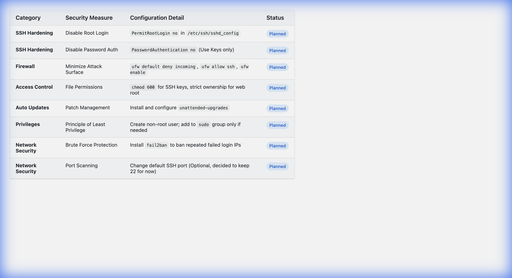

# Week 2: Security Planning and Testing Methodology

[← Back to Home](index.md)

## Introduction
This week I focused on planning out my security setup and figuring out how I'll test the server's performance. Before jumping into configurations, I wanted to have a clear plan.

## 1. Performance Testing Plan

### My Approach
To test how well my server performs, I'm going to use a mix of different tools. Some will generate fake load on the system, and others will measure how the system responds.

### Tools I'm Planning to Use

**For collecting metrics:**
- `mpstat` and `top` - to check CPU usage
- `free` and `vmstat` - to check memory
- `iostat` - to check disk read/write activity
- `iftop` - to check network traffic

**For generating load:**
- `sysbench` - a benchmarking tool that can stress the CPU
- `ab` (Apache Bench) - to simulate lots of web requests

### How I'll Collect Data
1. First I'll take baseline readings when the server is doing nothing (idle for about 5 minutes)
2. Then I'll run stress tests and take readings during the load (about 10 minutes)
3. Compare the two sets of data to see how the system behaves under pressure

## 2. Security Configuration Checklist

I have developed a comprehensive checklist to secure the server before deployment.

## 3. Threat Model

Using the **STRIDE** methodology, I identified key threats to my system and designed mitigations for them.

### Threat 1: Unauthorized Remote Access (Spoofing/Elevation)
*   **Description:** An attacker attempts to guess the root password or use stolen credentials to gain control of the server.
*   **Impact:** Critical. Full system compromise.
*   **Mitigation:** 
    *   Disable root login completely.
    *   Enforce SSH Key-based authentication (no passwords).
    *   Implement Fail2Ban to block repeated attempts.

### Threat 2: Service Vulnerability Exploitation (Tampering)
*   **Description:** An attacker exploits a known bug in an outdated service (e.g., Apache or OpenSSL) to run malicious code.
*   **Impact:** High. Could lead to data theft or server takeover.
*   **Mitigation:**
    *   Enable **Automatic Security Updates** to patch vulnerabilities daily.
    *   Configure Firewall (`ufw`) to expose *only* necessary ports (22, 80, 443).

### Threat 3: Denial of Service (DoS)
*   **Description:** An attacker floods the server with traffic or login requests, making it unresponsive for legitimate users.
*   **Impact:** Medium. Service downtime.
*   **Mitigation:**
    *   Firewall rate limiting (`ufw limit ssh`).
    *   Fail2Ban to ban aggressive IPs.
    *   Resource monitoring (`mpstat`, `iftop`) to detect anomalies early.

## Reflection
Writing out the security plan before doing anything felt a bit tedious at first, but it actually helped me understand WHY each security measure is important, not just HOW to do it.

---
[← Week 1](week1.md) | [Next: Week 3 →](week3.md)
