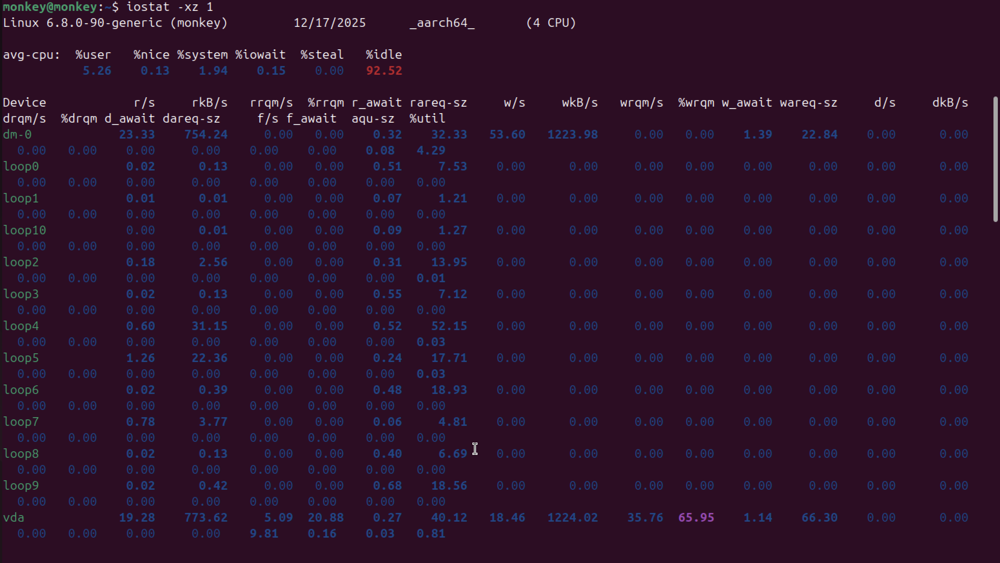
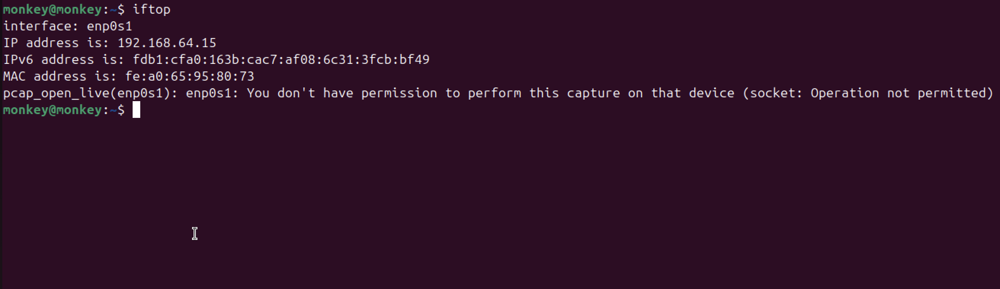
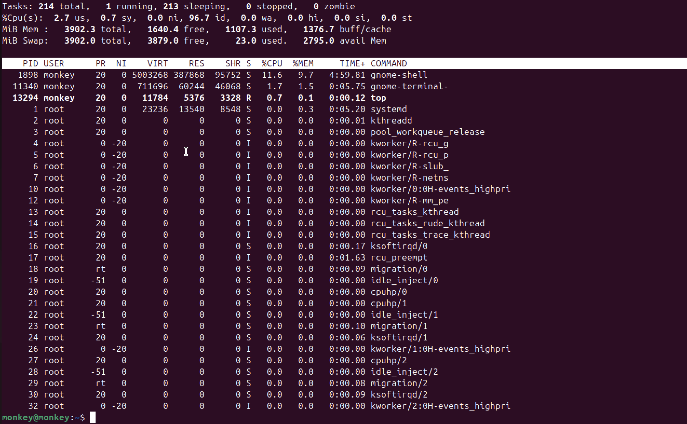

# Week 3: Phase 3 - Application Selection for Performance Testing

[← Back to Home](index.md)

## Introduction
This week focuses on selecting and installing the specific applications acting as workloads for our performance testing phase. I have selected a suite of industry-standard tools to isolate and stress specific system components.

## 1. Selected Applications

| Resource | Application | Description | Why Selected |
| :--- | :--- | :--- | :--- |
| **CPU** | `stress-ng` | A comprehensive stress testing tool | Can generate specific types of CPU load (matrix math, crypto, etc.) |
| **RAM** | `memtester` | Userspace memory tester | Effectively locks and tests specific amounts of RAM to simulate leaks or high usage |
| **Disk I/O** | `fio` | Flexible I/O Tester | The gold standard for storage benchmarking; allows complex read/write pattern definition |
| **Network** | `iperf3` | Network bandwidth measurement tool | Generates pure TCP/UDP traffic to measure maximum throughput |
| **Server App** | `apache2` | Apache Web Server | Representative of a real-world web serving workload |

## 2. Installation Documentation (SSH-Based)

All installations are performed via SSH on the server (`dipesh@10.41.17.2`).

### CPU & RAM Tools
```bash
# Update package list first
sudo apt update

# Install stress-ng and memtester
sudo apt install stress-ng memtester -y

# Verify installations
stress-ng --version
man memtester > /dev/null && echo "memtester installed"
```

### I/O & Network Tools
```bash
# Install fio and iperf3
sudo apt install fio iperf3 -y

# Verify installations
fio --version
iperf3 --version
```

### Server Application (Apache)
```bash
# Install Apache
sudo apt install apache2 -y

# Allow traffic through firewall
sudo ufw allow 'Apache'

# Verify service status
sudo systemctl status apache2
```

## 3. Expected Resource Usage & Monitoring Strategy

### CPU-Intensive (`stress-ng`)


**How I monitor this:**
I use a tool called `mpstat` to watch my CPU. It shows me exactly how hard each processor core is working. If I see one core at 100%, I know the stress test is working.

### RAM-Intensive (`memtester`)


**How I monitor this:**
I use `free -h` to see how much memory is being used in total. I also watch `vmstat` to see if the system runs out of RAM and starts using the hard drive (swap), which makes everything slow.

### I/O-Intensive (`fio`)


**How I monitor this:**
I use `iostat` to check the hard drive speed. It tells me how much data is being read or written every second. High "iowait" numbers mean the CPU is stuck waiting for the disk to finish.

### Network-Intensive (`iperf3`)


**How I monitor this:**
I use `iftop` or `ip` commands to watch network traffic. It's like a speedometer for the internet connection, showing exactly how many bits per second are moving in and out.

### Server Application (`apache2`)


**How I monitor this:**
I use `top` to see the overall health of the server and `tail` to watch the access logs in real-time. This lets me see every request hitting the web server as it happens.

---
[← Week 2](week2.md) | [Next: Week 4 →](week4.md)
