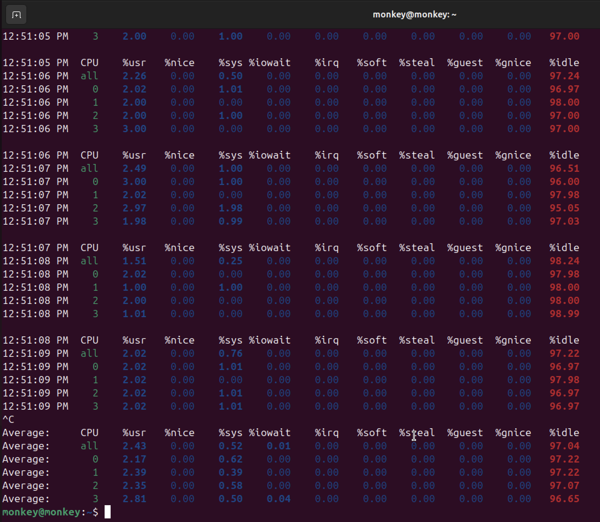
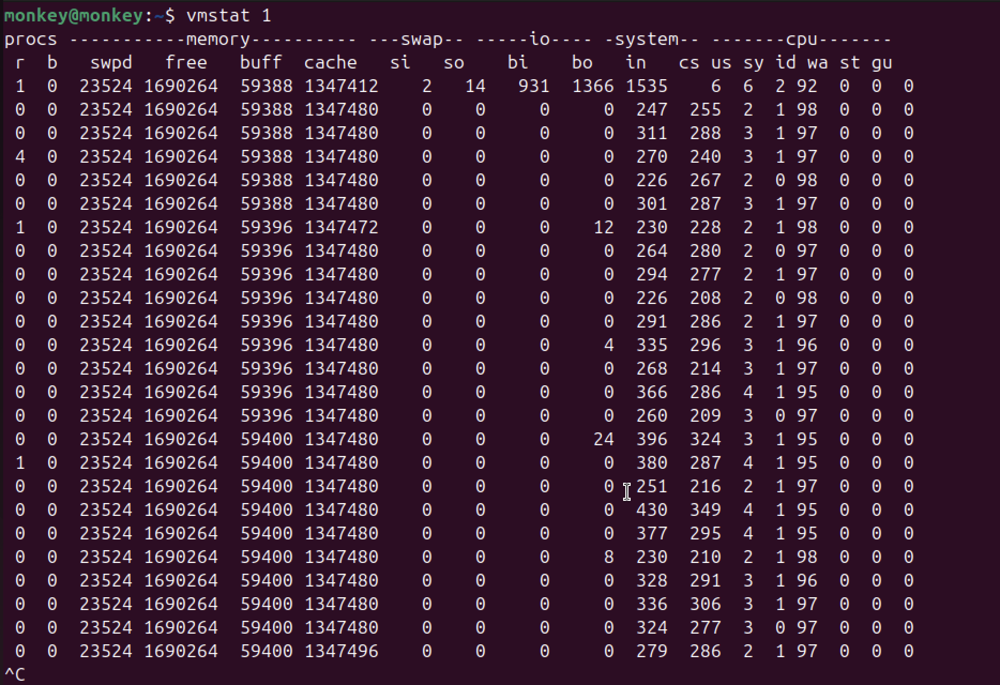

# Week 3: Phase 3 - Application Selection for Performance Testing

[← Back to Home](index.md)

## Introduction
This week focuses on selecting and installing the specific applications acting as workloads for our performance testing phase. I have selected a suite of industry-standard tools to isolate and stress specific system components.

## 1. Selected Applications

| Resource | Application | Description | Why Selected |
| :--- | :--- | :--- | :--- |
| **CPU** | `stress-ng` | A comprehensive stress testing tool | Can generate specific types of CPU load (matrix math, crypto, etc.) |
| **RAM** | `memtester` | Userspace memory tester | Effectively locks and tests specific amounts of RAM to simulate leaks or high usage |
| **Disk I/O** | `fio` | Flexible I/O Tester | The gold standard for storage benchmarking; allows complex read/write pattern definition |
| **Network** | `iperf3` | Network bandwidth measurement tool | Generates pure TCP/UDP traffic to measure maximum throughput |
| **Server App** | `apache2` | Apache Web Server | Representative of a real-world web serving workload |

## 2. Installation Documentation (SSH-Based)

All installations are performed via SSH on the server (`dipesh@10.41.17.2`).

### CPU & RAM Tools
```bash
# Update package list first
sudo apt update

# Install stress-ng and memtester
sudo apt install stress-ng memtester -y

# Verify installations
stress-ng --version
man memtester > /dev/null && echo "memtester installed"
```

### I/O & Network Tools
```bash
# Install fio and iperf3
sudo apt install fio iperf3 -y

# Verify installations
fio --version
iperf3 --version
```

### Server Application (Apache)
```bash
# Install Apache
sudo apt install apache2 -y

# Allow traffic through firewall
sudo ufw allow 'Apache'

# Verify service status
sudo systemctl status apache2
```

## 3. Expected Resource Usage & Monitoring Strategy

### CPU-Intensive (`stress-ng`)


### RAM-Intensive (`memtester`)


### I/O-Intensive (`fio`)
*   **Expected Behavior:** High wait times (iowait), high Read/Write KB/s.
*   **Monitoring Command:** `iostat -xz 1` (Detailed disk statistics)

### Network-Intensive (`iperf3`)
*   **Expected Behavior:** Saturated network link (up to ~1Gbps on standard links). High packet rates.
*   **Monitoring Command:** `iftop` or `ip -s link show enp0s5`

### Server Application (`apache2`)
*   **Expected Behavior:** Variable CPU/RAM usage depending on request rate (simulated later with `ab`).
*   **Monitoring Command:** `top` (General overview) and `tail -f /var/log/apache2/access.log` (Real-time traffic)

---
[← Week 2](week2.md) | [Next: Week 4 →](week4.md)
