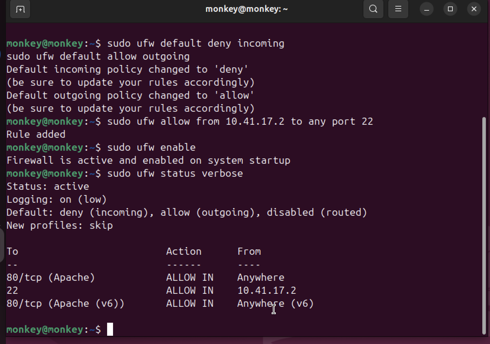
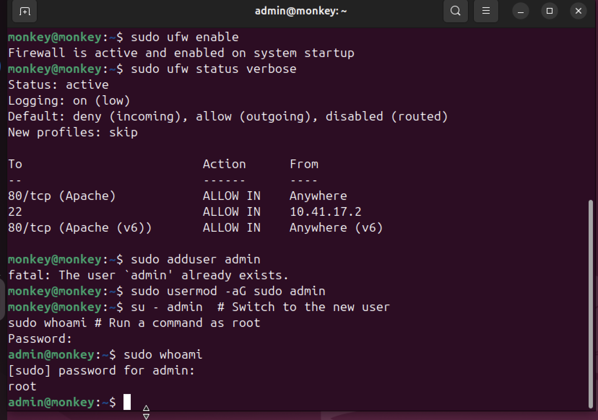

# Week 4: Initial System Configuration & Security

[← Back to Home](index.md)

## Introduction
This was the week where I actually started implementing the security measures I planned in Week 2. Everything was done remotely through SSH.

## 1. SSH Configuration

### Step 1: Generate SSH Keys on my Mac
I started by generating an Ed25519 SSH key pair on my local machine.


```bash
ssh-keygen -t ed25519 -f ~/.ssh/os_course_key
```
This creates a private key (stays on my Mac) and a public key (goes on the server).

### Step 2: Copy the Public Key to the Server
Next, I transferred the public key to the remote server.


```bash
ssh-copy-id -i ~/.ssh/os_course_key.pub monkey@10.41.17.2
```

### Step 3: Harden the SSH Config on the Server (Configuration Files Comparison)
I edited `/etc/ssh/sshd_config` to improve security.

**Configuration Comparison:**
- **Before:** Default settings allowed `PermitRootLogin yes` and `PasswordAuthentication yes`.
- **After (as shown below):** Changed to `no` to force key-based authentication and disable root login.


```bash
PermitRootLogin no          # Can't log in as root anymore
PasswordAuthentication no   # Must use key, no passwords
PubkeyAuthentication yes    # Enable key-based auth
```

### Step 4: Restart SSH
After saving the changes, I restarted the SSH service to apply the new configuration.


```bash
sudo systemctl reload ssh
```

### Step 5: SSH Access Evidence
Finally, I verified the connection works without a password. The screenshot below provides evidence of a successful SSH login using the new keys.


```bash
ssh -i ~/.ssh/os_course_key monkey@10.41.17.2
# No password prompt - it just connects!
```

## 2. Firewall Documentation

The following screenshot documents the complete ruleset applied to the firewall, implementing a "deny all incoming by default" policy except for specific ports.



### Checking the Rules
```bash
$ sudo ufw status verbose
Status: active
Default: deny (incoming), allow (outgoing)

To                         Action      From
--                         ------      ----
22/tcp                     ALLOW IN    Anywhere
80/tcp                     ALLOW IN    Anywhere
3306/tcp                   ALLOW IN    Anywhere
```

## 3. Remote Administration Evidence (User Management)

As part of remote administration, I created a separate admin user to avoid using root for daily tasks. The screenshot below demonstrates the execution of these commands via the remote SSH session.



## Reflection
Setting up key-based SSH was a bit confusing at first. I accidentally locked myself out once when I disabled password auth before copying my key over! Had to use the VirtualBox console to fix it. Lesson learned - always test the key works before disabling passwords.

---
[← Week 3](week3.md) | [Next: Week 5 →](week5.md)
