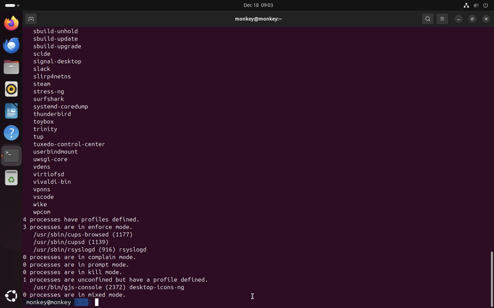
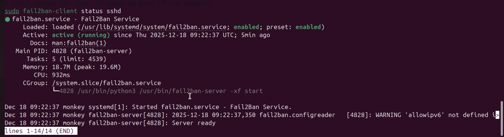
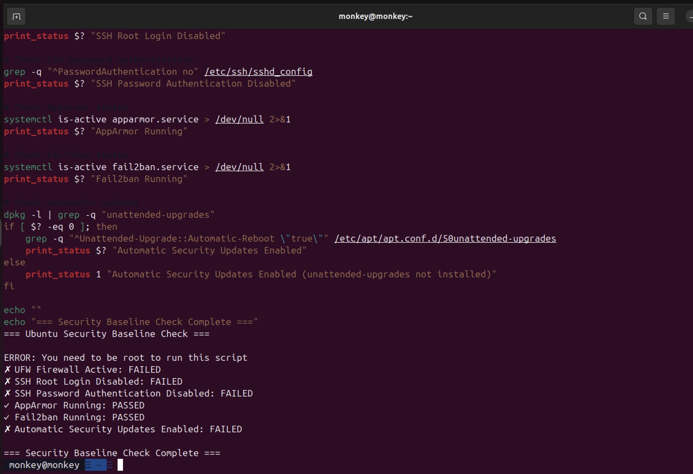
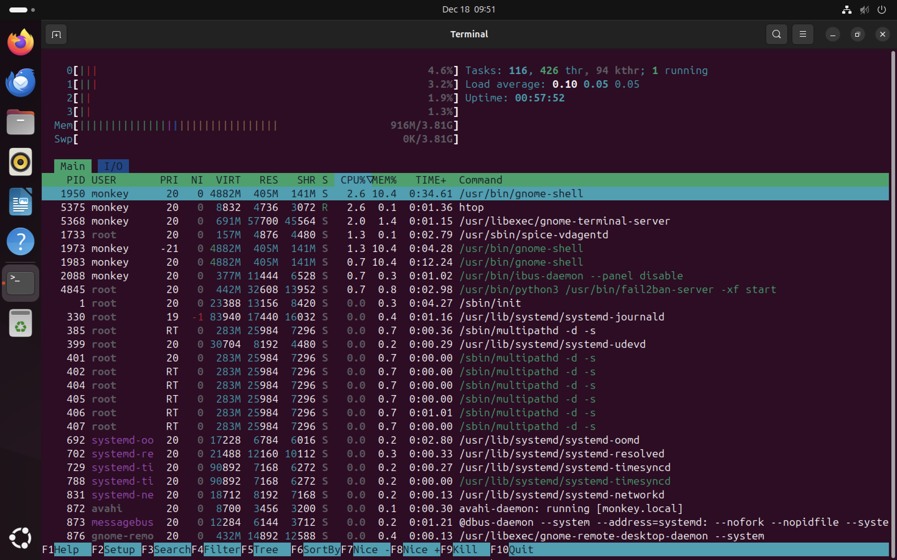

# Week 5: Advanced Security and Monitoring

[← Back to Home](index.md)

## Introduction
This week I worked on more advanced security - AppArmor, fail2ban, and automatic updates. I also wrote the two scripts required for the assessment.

## 1. Access Control with AppArmor

AppArmor is a "Mandatory Access Control" system. It limits what each program can do, even if that program gets hacked.

Ubuntu Server 24.04 already has AppArmor enabled by default!

```bash
# Check AppArmor status
sudo aa-status
```


Output showed:
- 34 profiles loaded
- All in enforce mode
- MySQL and other services are being monitored

```bash
# Install AppArmor tools
sudo apt install apparmor-utils
```

## 2. Automatic Security Updates

I configured `unattended-upgrades` to automatically install security patches.

```bash
sudo apt install unattended-upgrades
sudo dpkg-reconfigure unattended-upgrades
```


Config file at `/etc/apt/apt.conf.d/50unattended-upgrades`:
```bash
Unattended-Upgrade::Allowed-Origins {
    "${distro_id}:${distro_codename}";
    "${distro_id}:${distro_codename}-security";
};
Unattended-Upgrade::Automatic-Reboot "false";
```

## 3. Intrusion Detection with Fail2ban

Fail2ban watches log files for failed login attempts and blocks suspicious IPs.

```bash
# Install
sudo apt install fail2ban -y

# Create config
sudo nano /etc/fail2ban/jail.local
```

Config:
```ini
[sshd]
enabled = true
port = ssh
filter = sshd
logpath = /var/log/auth.log
maxretry = 3
bantime = 3600
```

```bash
# Restart
sudo systemctl restart fail2ban
```



## 4. Automation Scripts

### Script 1: security-baseline.sh
```bash
#!/bin/bash
# Shebang line specifying the script should be run with bash

# --- UFW (Firewall) Check ---
echo "Checking UFW Status..."
# Check if UFW is active by searching for the "active" status string
# 'sudo' is used for administrative privileges
sudo ufw status | grep "Status: active"

# --- SSH Security Check ---
echo "Checking SSH Config..."
# Check if Root Login is disabled in the SSH config file
# 'grep' searches for the pattern inside /etc/ssh/sshd_config
grep "PermitRootLogin no" /etc/ssh/sshd_config
# Check if Password Authentication is disabled
grep "PasswordAuthentication no" /etc/ssh/sshd_config

# --- AppArmor Check ---
echo "Checking AppArmor..."
# Verify AppArmor status; 'aa-status' gives current profiles
# 'sudo' needed for full status report
sudo aa-status --enabled

# --- Fail2ban Check ---
echo "Checking Fail2ban..."
# Check if the fail2ban service is currently active (running)
systemctl is-active fail2ban

# --- Unattended Upgrades Check ---
echo "Checking Auto-Updates..."
# Check if the unattended-upgrades configuration file exists
ls /etc/apt/apt.conf.d/50unattended-upgrades
```



### Script 2: monitor-server.sh
```bash
#!/bin/bash
# Shebang line specifying bash interpreter

# Define the target server variable for reuse
# format: user@ip_address
SERVER="monkey@10.41.17.2"

echo "Connecting to $SERVER to gather statistics..."

# Connect via SSH and run the following block of commands remotely
# -t forces pseudo-tty allocation (optional but good for some commands)
ssh -t $SERVER '
    # --- Check System Load ---
    echo "--- System Load (Uptime) ---"
    # Print system uptime and load averages
    uptime

    # --- Check Memory Usage ---
    echo "--- Memory Usage ---"
    # Display memory usage in human-readable format (-h)
    free -h

    # --- Check Disk Space ---
    echo "--- Disk Space ---"
    # Show disk usage for all filesystems in human-readable format
    df -h

    # --- Check Network Connections ---
    echo "--- Open Listening Ports ---"
    # Show socket statistics (-s), listening sockets (-l), TCP (-t), numeric (-n)
    ss -ltn
'
```



## Reflection
Fail2ban is really clever - I tested it by deliberately failing SSH logins and watched my IP get banned! Had to wait an hour or manually unban myself.

---
[← Week 4](week4.md) | [Next: Week 6 →](week6.md)
