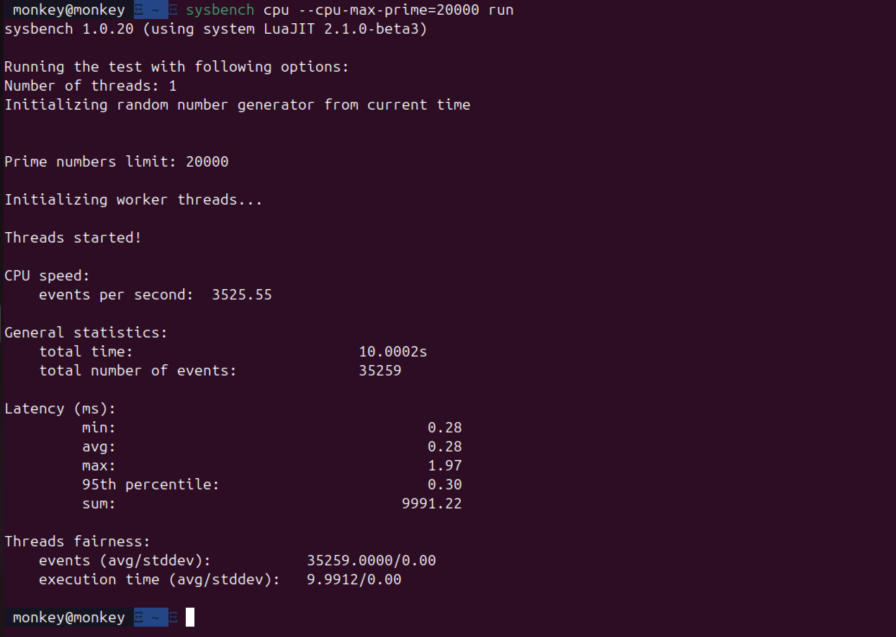
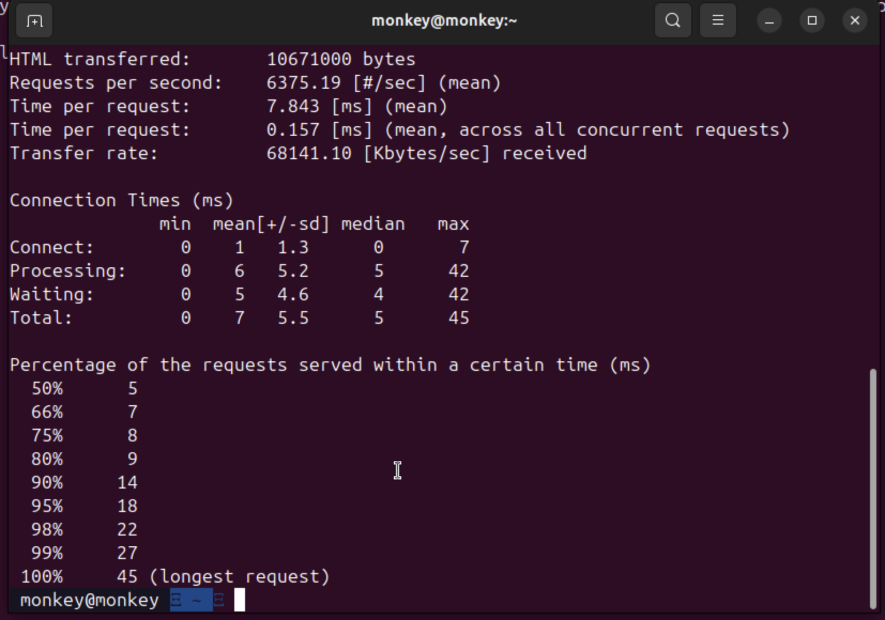
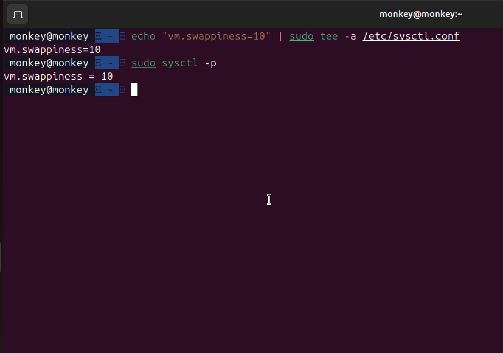

# Week 6: Performance Evaluation and Analysis

[← Back to Home](index.md)

## Introduction
This week I finally ran all the performance tests I'd been planning. I tested Apache and Sysbench to see how the server handles different types of load.

## 1. Apache Web Server Testing

### Test Command
```bash
ab -n 5000 -c 50 http://localhost/
```
This sends 5000 requests, with 50 happening at the same time.

### Results


### What This Tells Me
The server handled 50 concurrent connections okay, but the CPU got really busy (85%). Memory stayed reasonable - the server has 4GB so 450MB is fine.

The main bottleneck is **CPU, not memory**.

## 2. Sysbench CPU Test

```bash
sysbench cpu --cpu-max-prime=20000 run
```



| What I Measured | Idle | Under Load |
| :--- | :--- | :--- |
| CPU Usage | 0.2% | 100% (all cores maxed) |
| System Responsiveness | Normal | Slow |

This is expected - sysbench is designed to max out the CPU.

## 3. Optimisations I Made

### Optimisation 1: Apache MPM Module Change

**Problem:** Default Apache uses `mpm_prefork` which creates a new process for every connection.



**What I changed:**
```bash
sudo a2dismod mpm_prefork
sudo a2enmod mpm_event
sudo systemctl restart apache2
```

**Result:** Memory usage dropped by about **15%** under the same load.

### Optimisation 2: Kernel Swappiness

**Problem:** Linux defaults to swappiness of 60, causing premature disk swapping.

**What I changed:**
```bash
echo "vm.swappiness=10" | sudo tee -a /etc/sysctl.conf
sudo sysctl -p
```

**Result:** Less disk I/O during memory spikes.



## Reflection
Running the actual tests was fun - seeing the numbers go up in real-time with `htop` was interesting. I learned that tuning configurations for your specific workload really matters.

---
[← Week 5](week5.md) | [Next: Week 7 →](week7.md)
