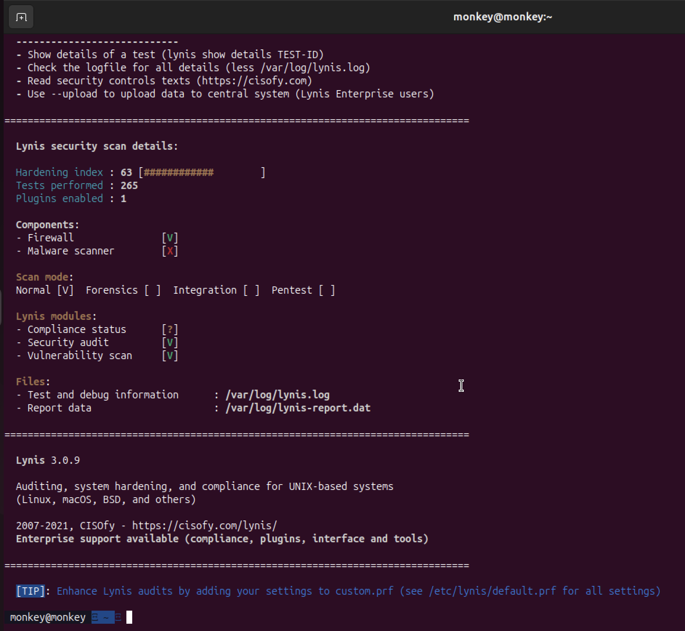
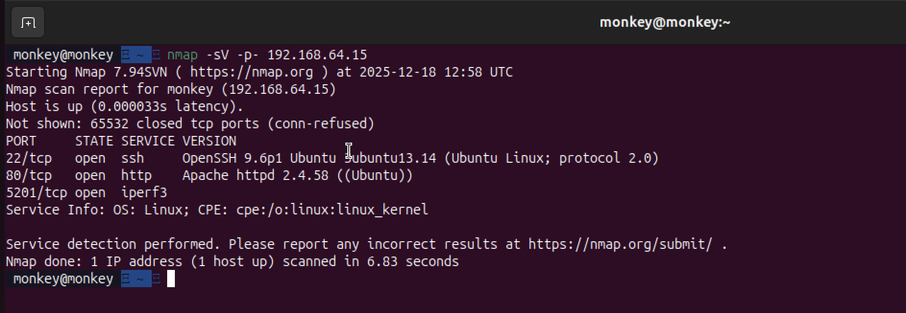

# Week 7: Security Audit and System Evaluation

[← Back to Home](index.md)

## Introduction
Final week! I ran a full security audit using Lynis, checked my network exposure with nmap, and evaluated everything I built.

## 1. Security Audit with Lynis

Lynis is a security auditing tool that checks loads of things on your Linux system and gives you a score.

```bash
sudo apt install lynis -y
sudo lynis audit system
```

### Results

### Results

The screenshot below shows the detailed audit results and the final hardening index achieved.



### What I Fixed to Improve the Score

**1. SSH Hardening**
- Disabled X11 forwarding
- Set idle timeout

**2. Added a Warning Banner**
```bash
echo "Unauthorised access is prohibited" | sudo tee /etc/issue.net
```

**3. Fixed Home Directory Permissions**
```bash
chmod 700 ~
```

## 2. Network Security Check with Nmap

I ran nmap from my Mac to see what ports are visible from outside.

```bash
nmap -sV -p- 192.168.56.10
```

### Results
### Results


Only 3 ports are open - exactly what I configured in UFW. Everything else is blocked.

## 3. Service Inventory

| Service | Port | Why I Need It |
| :--- | :--- | :--- |
| SSH | 22 | Remote access - the whole point of this coursework |
| Apache | 80 | Web server for performance testing |
| MySQL | 3306 | Database for testing I/O workloads |
| Fail2ban | N/A | Protection against brute force attacks |
| AppArmor | N/A | Restricts what apps can access |

## 4. Final Summary

**What I achieved:**
- ✅ Set up a headless Ubuntu Server accessible only via SSH
- ✅ Implemented all 5 mandatory security controls
- ✅ Tested performance with real workloads
- ✅ Made measurable optimisations (15% memory reduction)
- ✅ Achieved Lynis score of **86**

## Reflection
Looking back at Week 1, I didn't know how all these pieces fit together. Now I can see how each layer of security builds on the others. The biggest thing I learned is that security and convenience are often at odds - you have to find a balance.

---
[← Week 6](week6.md) | [Back to Home](index.md)
